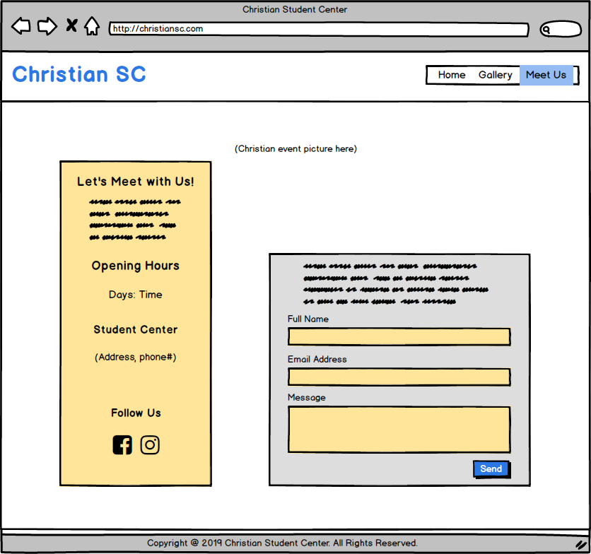

# Christian Student Center
This is a 3-page static User Centric frontend development website for Christian Student Center. The website started with a warmed welcome with background picture of the saints in student center. This followed by a simple introduction of the usage of student center, that to give a whole picture on what a campus student can do at this place. The page ended with the announcement of the upcoming events for campus students.

The second page, which is the gallery page displayed the collection from variety of events in video and pictures form. While the final page is Meet Us page, that allowed the users to contact the saints, either by the contact details given, or by filling out the contact form to have the saints to contact them.

The deployed website is at https://kongteckmee.github.io/christian-sc/

## UX
This website acts as an official website of Christian Student Center, showing the usage of this place and the events offer to the campus students. The website should describe the student center in a very simple way, yet giving the information needed by the users. Also, it should let the users know on where is the place and how they can contact the saints.

### User Stories
 - As a campus student that looking for meaningful life, I want to see an official website that can make an introduction to Christian Student Center and the way to know more about the events and the saints.
 - As the parents to campus student, I want to see who my children connected to and what they are pursuing besides studying at the campus.
 - As the saints at Christian Student Center, I want to be able to show what is the main usage of this place, to show the events that we offer to the campus students and the way they can get in touch with us.

### Wireframes
The wireframes below created to have a design view before the code development of the website. The second and the final page been added during the code development as the need of supporting the goal towards the users. The current version have some differences in positioning, especially in Mobile screen size.

#### Desktop View
###### [Home] | [Gallery] | [Meet Us]
&nbsp;
&nbsp;
&nbsp;

#### Tablet View
###### [Home] | [Gallery] | [Meet Us]
&nbsp;
&nbsp;
&nbsp;

#### Mobile View
###### [Home] | [Gallery] | [Meet Us]
&nbsp;
&nbsp;
&nbsp;

## Features
### Existing Features

###### Feature 1 - Navigation Bar
 - This is a navigation bar at upper right side that can bring the users to each of the page of website.
 - The navigation bar will be under the logo at upper left side when the screen size is in between 360px and 767px.

###### Feature 2 - Footer
 - The footer contain a short line of text for copyright notice.

###### Feature 3 - Media Query
 - Each of the page in the website is responsive to the users screen size, either in Desktop, Tablet or Mobile.

###### Feature 4 - Home Page
 - The Home page consists of the picture of the saints with simple welcome texts, simple details of the usage of the Christian Student Center and the upcoming events that can be joined by the campus students.

###### Feature 5 - Gallery Page
 - The Gallery page consists of the video and photos collection from variety of events that held, either in Christian Student Center itself, or at outdoor. This is to let the users to know what the saints are doing and to encourage more campus students to join them.

###### Feature 6 - Meet Us Page
 - The Meet Us page includes the Opening Hours for Christian Student Center, the exact place of Christian Student Center, and the way the users can contact the saints.
 - A simple contact form is available to let the users to leave a message so the saints can have further contact with them.

### Future Features

###### Simple Feedback/Testimonial
 - A simple feedback from the campus students will added the points to encourage more campus students to fully utilized the student center.
 - The real testimony will also supporting how enjoyable and meaningful to be with the saints.

###### Contact Form Submission
 - This feature is to submit the data of the contact form to the saints. 

###### Updated Church News in PDF
 - The Church News in PDF format can be downloaded. This is to let the users to get the most updated reports from the student center.

## Technologies Used
The below are the technologies used to complete this project:

[Balsamiq](https://balsamiq.com/)
 - Balsamiq used to create the wireframes for each page of the website when designing the UX of the project.

[AWS Cloud9](https://aws.amazon.com/cloud9/)
 - Cloud9 IDE used to write the code in HTML5 and CSS3 when creating the website.

[HTML5](https://en.wikipedia.org/wiki/HTML5)
 - HTML5 used to create the layout of the website.

[CSS3](https://en.wikipedia.org/wiki/Cascading_Style_Sheets)
 - CSS3 used to style the layout that have been coded in HTML5.

[Google Font](https://fonts.google.com/)
 - Google Fonts imported to be the fonts in the website. Two types of fonts used:
    - Merriweather - The font family for the logo and the title.
    - Roboto - The font family for the content.

[Font Awesome](https://fontawesome.com/)
 - Font Awesome used to provide the icons for Upcoming Event section, and the icons for social media: Facebook and Instagram.

[Git & GitHub](https://github.com/)
 - Git used for version control, and GitHub used as a remote repository and the hosting of the website.
 
[PIXLR](https://pixlr.com/)
 - PIXLR used to resize, edit and crop the pictures in the website.
 
[Windows 10's Video Editor](https://www.howtogeek.com/355524/how-to-use-windows-10s-hidden-video-editor/)
- Windows 10's Video Editor used to create the video in the website.

[YouTube](https://www.youtube.com/)
- YouTube used to upload the video that have created. This is to display the video in website by using iframe coding.

[Markup Validation Service](https://validator.w3.org/)
- Markup Validation Service used to check the markup (HTML & CSS) of the website.

## Testing
The website is tested in a few ways. Below are the testing process to ensure they are works as intended for the users to achieve their goals.

1. Logo & Navigation Bar:
    1. Go to the website.
    2. Hover to each button and verify if the text changed to blue color.
    3. Click on "Gallery" button and verify if can go "Gallery" page and the shadow on "Gallery" button appear.
    4. Click on "Meet Us" button and verify if can go "Meet Us" page and the shadow on "Meet Us" button appear.
    5. Click on the logo and verify if can go back to "Home" page.

2. Video:
    1. Go to "Gallery" page.
    2. Verify if the video is display at website. 
    3. Click on the play button and verify if the video will play until the end.

3. Social Media Icon:
    1. Go to "Meet Us" page.
    2. Hover to the "Facebook" and "Instagram" icon and verify if the icon changed to blue color.
    3. Click on "Facebook" icon and verify if the Facebook account page for Christian Student Center will be opened in another tab.
    4. Click on "Instagram" icon and verify if the Instagram account page for Christian Student Center will be opened in another tab.

4. Contact Form:
    1. Go to "Meet Us" page.
    2. Hover to the text fields and text area and verify if notification for required field appear.
    3. Hover to the text fields and text area and verify if the border changed to blue color.
    4. Try to submit an empty form and verify if an error message at the first required field appear.
    5. Try to submit a form with name but with invalid email address and verify if an error message appear.
    6. Try to submit the form with all valid inputs and verify if the form resets itself.

The website is tested at browsers below and it works as intended:
1. Google Chrome
2. Firefox
3. Internet Explorer

The Chrome DevTools used to test all pages with screen size in simulated devices below and verify all pages displayed as intended:
1. iPad - The width for screen size of 768px and 991px
2. Galaxy S5 - The width for screen size of 360px and 767px

The website also tested in physical devices below to ensure all pages displayed exactly as intended:
1. iPad a1893 - The width for screen size of 768px and 991px
2. Nova 4 - The width for screen size of 360px and 767px

#### Issue
 - The contact form is not working to send the messages. It will resets itself when the users click the Send button. This function will be implemented later.

## Deployment
This project is published on GitHub pages, it can be viewed at:

https://kongteckmee.github.io/christian-sc/

## Credits
### Content
 - All wording are used by the permission from the saints in Christian Student Center.

### Media
 - The pictures of events used in each of the page were obtained from the saints in Christian Student Center, together with their permission. 
 - The pictures in About section at Home page were sourced from Google search. All pictures in this section can be reused by anyone that get from Google search the same.
 - The video 'Campus Outing' created with the permission from the saints in Christian Student Center.

### Acknowledgements
 - Thanks to [Dick Vlaanderen](https://github.com/dickvla), my mentor from Code Institute for his guidance during the project.
 - Thanks to the saints in Christian Student Center, as I received the inspiration for this project from them. They suggested on what to be in the website and provided me with all related pictures and details.
 - I get the idea of the layout of website from the 'Love Running' subject under CSS Fundamentals module from Code Institute.
 - In the middle of the project, I refer to [w3schools.com](https://www.w3schools.com/) especially when putting all the codes together, and also to pick the suitable color to the fonts and the pages.